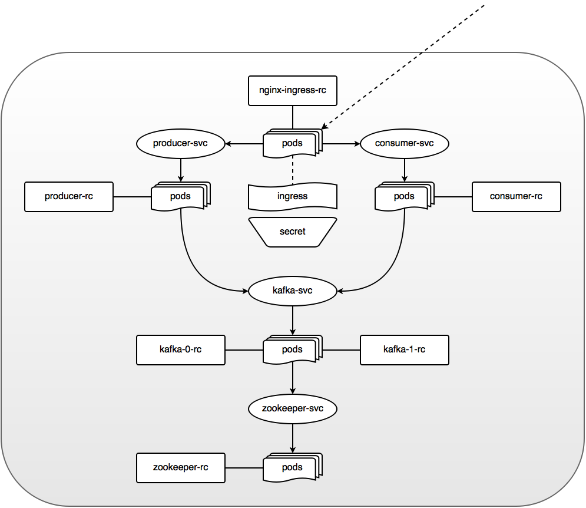

# Apache Kafka on Kubernetes

## Diagram

## REST API
Get the number of messages produced:

    GET https://<k8-worker-node-ip>:443/kafka-producer/api/0/status
Get the number of messages consumed:

    GET https://<k8-worker-node-ip>:443/kafka-consumer/api/0/status
Tell the producer to publish a message in Kafka:

    POST https://<k8-worker-node-ip>:443/kafka-producer/api/0/process
The POSTed message is in the JSON format:

    {
        "id": 0,
        "parameters": ["a=b", "c=1"]
    }

## Prerequisites
Install kubernetes with Vagrant and CoreOS by following this guide:
https://coreos.com/kubernetes/docs/latest/kubernetes-on-vagrant.html

Make sure kubernetes is up and running:

    kubectl get nodes
    kubectl cluster-info
Also, get the docker daemon up and running.

## Project Structure
The `/docker` directory contains all of the code needed to push each of the docker images used to the docker hub. The helper scripts:

    docker/consumer/build.sh
    docker/kafka/build.sh
    docker/producer/build.sh
    docker/zookeeper/build.sh
The `/src` directory contains all of the source code for the consumer and producer. Use maven to build the war packages and import the projects into eclipse. The helper scripts:

    src/producer/update-tomcat.sh
    src/consumer/update-tomcat.sh
The `/k8` directory contains all of the kubernetes DSL files needed to build the cluster. The helper scripts:

    k8/kubectl-create.sh
    k8/kubectl-delete.sh

